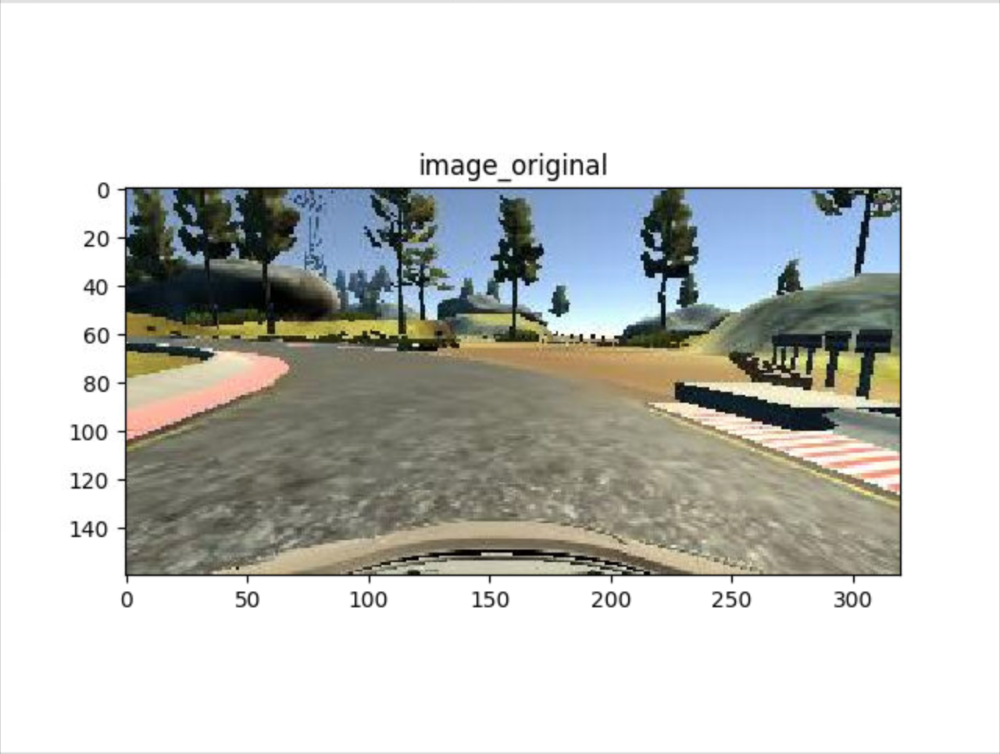
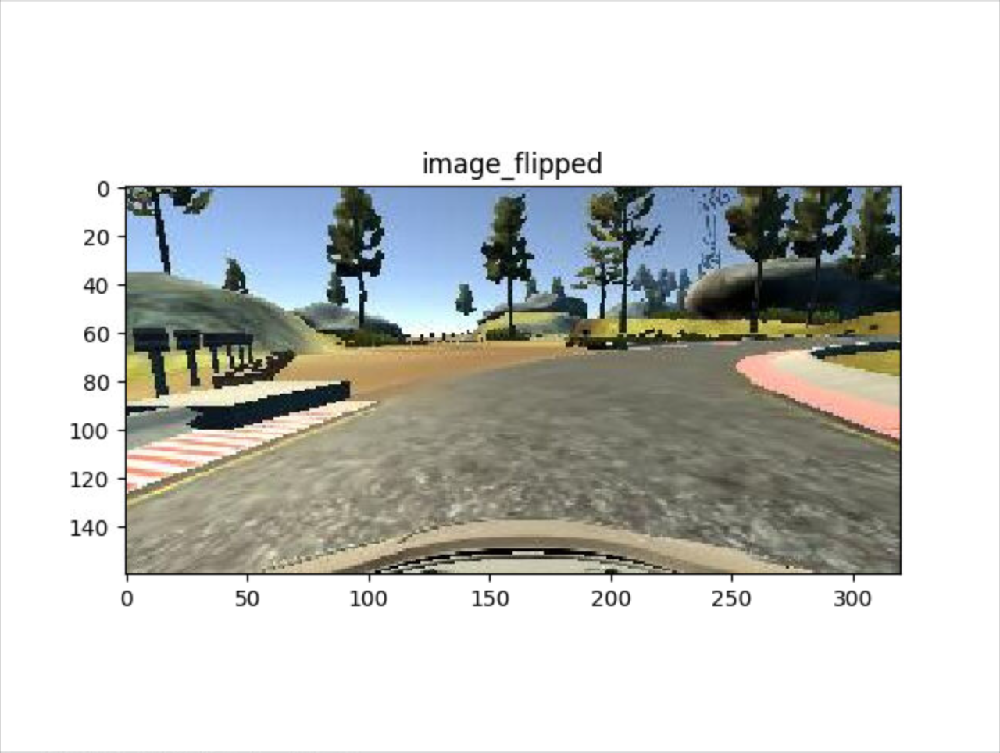
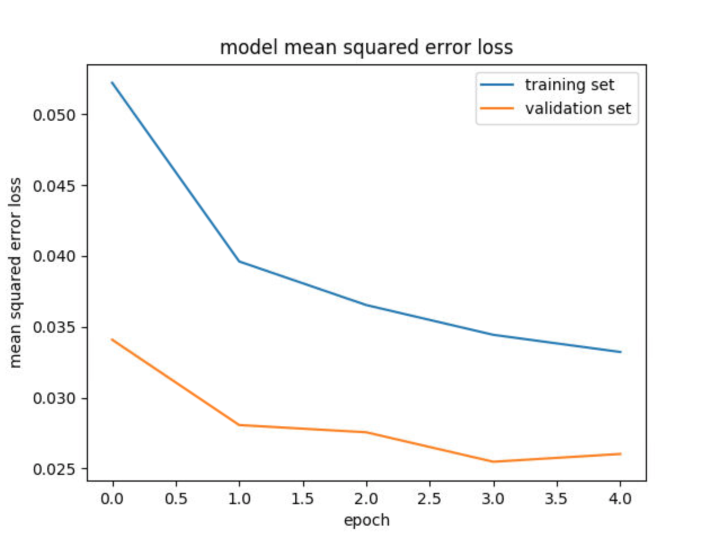

# Behavioral Cloning Project

The goals / steps of this project are the following:

* Use the simulator to collect data of good driving behavior
* Build, a convolution neural network in Keras that predicts steering angles from images
* Train and validate the model with a training and validation set
* Test that the model successfully drives around track one without leaving the road
* Summarize the results with a written report

## Files Submitted & Code Quality

## 1. Submission includes all required files and can be used to run the simulator in autonomous mode

My project includes the following files:

* model.py containing the script to create and train the model * drive.py for driving the car in autonomous mode
* model.h5 containing a trained convolution neural network
* writeup.pdf summarizing the results

## 2. Submission includes functional code

Using the Udacity provided simulator and my drive.py file, the car can be driven autonomously around the track by executing
python drive.py model.h5

## 3. Python generator

Instead of storing the data in memory all at once, using a generator can pull pieces of the data and process them on the fly only when you need them, which is much more memory-efficient. In ( model.py lines 56-83 ) I used a python generator to provide training and validation data.

## 4. Submission code is usable and readable

The model.py file contains the code for training and saving the convolution neural network. The file shows the pipeline I used for training and validating the model, and it contains comments to explain how the code works.

## Model Architecture and Training Strategy

## 1. An appropriate model architecture has been employed

My model consists of 5 convolution neural network layers and 4 fully connected layers (model.py lines 90-124). The model is in the function ‘model_nvidia( )'. This model use Navidia End to End training model.
The model includes RELU layers to introduce nonlinearity, and the data is normalized in the model using a Keras lambda layer ( line 97 ). The Cropping2D layer provided by Keras for image cropping is applied in the model ( line 98 ).

## 2. Attempts to reduce overfitting in the model

The model contains dropout layers in order to reduce overfitting. I use RELU as activation fucntion and add 0.5 dropout at fully connected layer.
The model was trained and validated on different data sets to ensure that the model was not overfitting. The model was tested by running it through the simulator and ensuring that the vehicle could stay on the track.

## 3. Model parameter tuning

The model used an adam optimizer, so the learning rate was not tuned manually (model.py line 162). MSE cost function and a callback fucntion for earlystopping are also applied. Use the adam optimizer default setting. The batch_size is 256. Epoch is 5.
## 4. Appropriate training data

Training data was chosen to keep the vehicle driving on the road. I used a combination of center lane driving, recovering from the left and right sides of the road. Measurements of Left/right images was adjust by offset=0.3 compare with center image.
For details about how I created the training data, see the next section.

## Model Architecture and Training Strategy

The data provided by Udacity is used in this project. I split my image and steering angle data into a training and validation set. I finally randomly shuffled the data set and put 20% of the data into a validation set. I used this training data for training the model. The validation set helped determine if the model was over or under fitting. The preprocess of the data includes normalization and cropping.

## Data augmentation

To augment the training data, I combined the center images and side images, at the same time, I flipped the Images And Steering Measurements ( in lines 76-78). I take original image “center_2016_12_01_13_31_14_194.jpg” as example. The corresponding code is given in flipped.py. The original image and flipped result is shown as follow:

The final step was to run the simulator to see how well the car was driving around track one. It shows it works well all the time. At the end of the process, the vehicle is able to drive autonomously around the track without leaving the road.
The model mean square error loss is given in followed figure:

